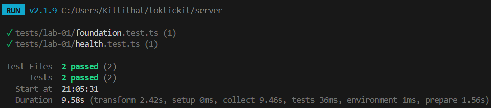
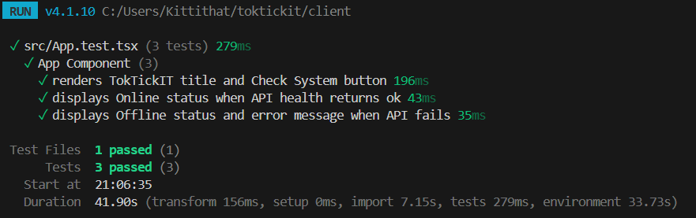

# Peer Review Evidence - Lab 1

## My Information

| **Name**  | **Student ID** | **GitHub Username** |
| :--- | :--- | :--- |
| Kittithat Disthanakornkun | [67070501004] | [@JeffMerry](https://github.com/JeffMerry) |

---

## Peer Reviewer (Primary)

| **Name**  | **Student ID** | **GitHub Username** |
| :--- | :--- | :--- |
| Thanatip Nitinantakul | [67070501023] | [@ThnaChamp](https://github.com/ThnaChamp) |

---

## Pull Requests Reviewed

### PR 1 — feature/1-project-foundation → lab1-staging

| Field | Detail |
|-------|--------|
| **PR Link** | https://github.com/JeffMerry/toktickit/pull/5 |
| **Reviewer** | Thanatip Nitinantakul [@ThnaChamp](https://github.com/ThnaChamp) |
| **Review Comment** | "[Good job Kittithat.]" |
| **My Response** | Nothing was changed. PR was approved and merged |
| **Outcome** | Approved and merged |

### PR 2 — feature/2-health-check → lab1-staging

| Field | Detail |
|-------|--------|
| **PR Link** | https://github.com/JeffMerry/toktickit/pull/6 |
| **Reviewer** | Thanatip Nitinantakul [@ThnaChamp](https://github.com/ThnaChamp) |
| **Review Comment** | "[Very well done; detailed and comprehensive.]" |
| **My Response** | Nothing was changed. PR was approved and merged |
| **Outcome** | Approved and merged |

### PR 3 — feature/3-category-seed → lab1-staging

| Field | Detail |
|-------|--------|
| **PR Link** | https://github.com/JeffMerry/toktickit/pull/7 |
| **Reviewer** | Thanatip Nitinantakul [@ThnaChamp](https://github.com/ThnaChamp) |
| **Review Comment** | "[Could you clarify which command you used to apply the schema.prisma to the database? I'm asking because using 'npx prisma migrate dev' normally generates a migration history folder.]" |
| **My Response** | In the early development and testing phase, the npx prisma db push command was used to directly create tables in PostgreSQL using the schema.prisma file for quick initial system testing. To ensure compatibility, the npx prisma migrate dev command was needed to create a prisma/migrations/ folder along with a migration.sql file for correct execution on other systems. |
| **Outcome** | Use the command `npx prisma migrate dev` to create a database structure change log file (Migration SQL) and update the database structure on your computer (development) to match the code changes you made in the schema.prisma file. |

### PR 4 — feature/4-category-list → lab1-staging

| Field | Detail |
|-------|--------|
| **PR Link** | https://github.com/JeffMerry/toktickit/pull/8 |
| **Reviewer** | Thanatip Nitinantakul [@ThnaChamp](https://github.com/ThnaChamp) |
| **Review Comment** | "[Could you please upload the test results for both the frontend and the backend?]" |
| **My Response** | Sure The automated test results for both frontend and backend are all passing successfully. I've updated the test documentation in docs/lab-01/tests.md. Test Summary: Backend (Supertest): All endpoints (GET /api/health and GET /api/categories) passed. Frontend (Vitest & RTL): Heading rendering, Category list display, and API error states passed.  |
| **Outcome** | Approved and merged |

### Reviewed Pull Requests (Partner's PR reviewed by me)

### PR A — feature/2-health-check → lab1-staging

| Field | Detail |
|-------|--------|
| **PR Link** | [https://github.com/ThnaChamp/toktickit/pull/6](https://github.com/ThnaChamp/toktickit/pull/6) |
| **My Review Comment** | "[The structure is easy to read, and it effectively validates HTTP status codes and JSON response structures.]" |
| **Partner's Response** | Nothing was changed. |
| **Outcome** | Approved and merged |

---